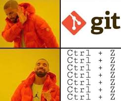

# **Lesson Week 1**
# Lesson 1: Unix Comand Line
[__Comand-Line Interface (CLI)__](https://en.wikipedia.org/wiki/Command-line_interface), merupakan mekanisme berbentuk antarmuka berbasis teks yang digunakan user untuk melakukan interaksi dengan Sistem Operasi Komputer. CLI digunakan sebab pemberian akses penuh, cepat, dan ringkas kepada user untuk mengakses komputer, beberapa perantara CLI seperti Terminal, Dos, Shell, CMD, dsb.

Basic Terminal Commands: 

File navigation, file manipulation, folder/directory manipulation, text, installation.

# Lesson 2: Git & Github
Untuk di ketahui Terebih dahulu bahwa [__Git & Github itu 2 hal yang berbeda_](https://www.dicoding.com/blog/perbedaan-git-dan-github/) [__Git__](https://id.wikipedia.org/wiki/Git) merupakan _VCS(Version Control Sistem)_ atau pengelola versi project/file yang bisa dikelola sendiri atau kelompok. Dan [__Github__](https://www.dicoding.com/blog/apa-itu-github/) adalah layanan web cloud bersama yang menggunakan sistem kendali versi Git.

Mudahnya Github ini adalah website yang di dalamnya menggunakan Git. Version file yang kita kelola dengan Commit. Git & Github bisa di gunakan bersamaan dengan meRemote file online di Github dan mengupload download file kita dengan push dan pull 

jadi file kita bisa dikelola dengan lebih jelas dalam perubahan di setiap versi.

# Lesson 3: HTML
[__HTML(Hypertext Markup Language__)](https://developer.mozilla.org/en-US/docs/Web/HTML) merupakan markup language yang digunakan untuk menampilkan konten pada browser. HTML dapat dibuat hanya dengan code editor dan browser. HTML bisa di buat tanpa structure tapi HTML akan berjalan lebih baik dengan structur yang baik. HTML memiliki [__Element__](https://www.w3schools.com/html/html_elements.asp) dan [__Atribute__](https://www.w3schools.com/html/html_attributes.asp) atau properties yang ada pada element

# Lesson 4: CSS

[__CSS(Cascading Style Sheets)__](https://www.w3schools.com/css/) di tambahkan bertujuan untuk mempercantik tampilan HTML yang kaku. CSS juga memiliki struktur yaitu elementhtml{property : value}. CSS dimasukkan kedalam HTML dengan 3 cara, yaitu dengan Inline style(memasukan langsung di file html sebagai attribute di element), Tag style(menambahkan element tag pada html), dan yang ketiga menggunakan file .css dan dihubungkan pada HTML dengan __tag__ link pada __head__ HTML.

# Lesson 5: Algoritma & Pseudocode
[__Algoritma__](https://id.wikipedia.org/wiki/Algoritma) merupakan proses atau tahapan yang dibutuhkan untuk menyelesaikan suatu masalah dengan runut dan efisien. Dalam programing berisi [_struktur data_](https://www.geeksforgeeks.org/data-structures/) yang digunakan untuk mengelola data dan algoritma digunakan untuk menyelesaikan permasalahan serta tujuan yang ingin dicapai dengan data itu, dan [__Pseudocode__](https://en.wikipedia.org/wiki/Pseudocode) adalah cara untuk menuliskan algoritma dengan peraturan penulisan tertentu.
Procedural: merupakan cara berpikir secara runut. 
Conditional: algoritma yang memiliki percabangan kasus, dan melakukan tindakan saat salah satu kondisi terpenuhi
Loop: perulangan tindakan disesuaikan dengan kondisi yang di tentukan
Recursive: pola piker algoritma yang memanggil method/function yang ada dalam function.

